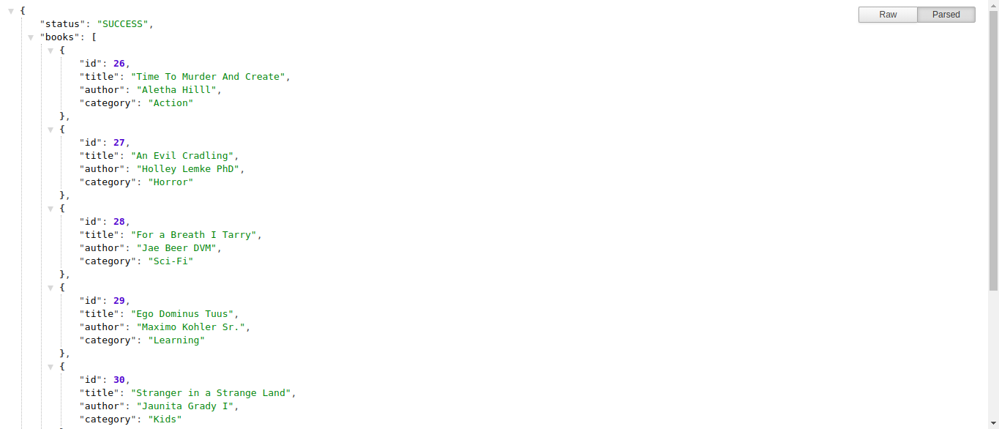

<h1 align="center">Bookstore API</h1>
<p>
  
  <a href="https://github.com/ebukaume/bookstore-api#readme" target="_blank">
    
  </a>
  <a href="https://github.com/ebukaume/bookstore-api/graphs/commit-activity" target="_blank">
    
  </a>
  <a href="https://github.com/ebukaume/bookstore-api/blob/master/LICENSE" target="_blank">
    
  </a>
  <a href="https://twitter.com/ebukaume" target="_blank">
    
  </a>
  <a href="https://twitter.com/YunusAybey" target="_blank">
    
  </a>
</p>

<br>

<p>
  <a href="https://bookstore-react-redux.herokuapp.com" target="_blank">
    
  </a>
</p>

<br>

The project is part of a series of projects to be completed by students of [Microverse](https://www.microverse.org/ "The Global School for Remote Software Developers!").

  This is a collaborative project by [Y.Emre AYBEY](https://github.com/YemreAybey) and [Ebuka Umeokonkwo](https://github.com/ebukaume). In this project, we implemented a basic API infrastructure to power our Bookstore CMS webapp built with React and Redux. The live link for the bookstore is [here](https://bookstore-react-redux.herokuapp.com/) while the repo is over [here](https://github.com/YemreAybey/bookstore-redux).

## Technologies

- Ruby 2.5.1
- Rails 6.0.1
- Postgresql >= 0.18  and < 2.0


## Usage

The service is running @ http://bookstore-redux-api.herokuapp.com/api/v1 and it only a single endpoint `/books`


## Routes 

```
GET         /books
POST        /books
DELETE      /books/{id}
```

## Authors

👤 **Ebuka UMEOKONKWO**

- Github: [@ebukaume](https://github.com/ebukaume)
- Twitter: [@ebukaume](https://twitter.com/ebukaume)

👤 **Y.Emre AYBEY**

- Github: [@YemreAybey](https://github.com/YemreAybey)
- Twitter: [@YunusAybey](https://twitter.com/YunusAybey)

## 🤝 Contributing

Contributions, issues and feature requests are welcome!<br />Feel free to check [issues page](https://github.com/ebukaume/bookstore-api/issues).

1. Fork it (https://github.com/ebukaume/bookstore-api.git/fork)
2. Create your working branch (git checkout -b [choose-a-name])
3. Commit your changes (git commit -am 'what this commit will fix/add/improve')
4. Push to the branch (git push origin [chosen-name])
5. Create a new Pull Request

## Show your support

Give a ⭐️ if you like this project!

## License

This project is licensed under the MIT License - see the [LICENSE](./LICENSE) file for details
